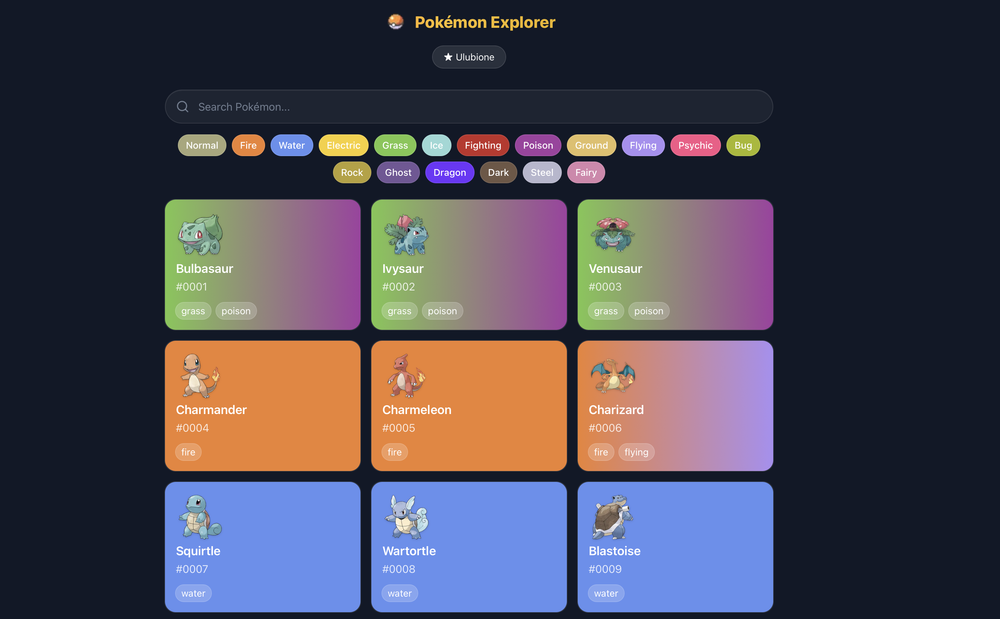
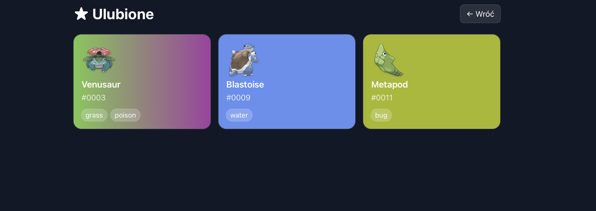

# Pokémon Explorer ⚡

Aplikacja webowa do eksplorowania Pokémonów z API (https://pokeapi.co).
Możesz wyszukiwać, filtrować po typach, przeglądać szczegóły w modalu i dodawać Pokémony do ulubionych (localStorage).

---

## 🚀 Tech stack

- [Next.js 14](https://nextjs.org/) (App Router, RSC + client components)
- [React Query](https://tanstack.com/query) – cache i fetching danych
- [TailwindCSS](https://tailwindcss.com/) – stylowanie
- [PokeAPI](https://pokeapi.co/) – źródło danych
- LocalStorage – przechowywanie ulubionych

---

## ⚡ Features

- 🔍 **Wyszukiwanie** po nazwie
- 🌀 **Infinite scroll** (ładowanie kolejnych stron)
- 🎨 **Filtrowanie po typach**
- 📖 **Modal z detalami**
- ⭐ **Ulubione** (zapisywane w localStorage)
- 📱 **Responsywność** (mobile-first)

---

## 🛠️ Instalacja i uruchomienie

### 1. Klonowanie repo

```bash
https://github.com/SculptTechProject/wave_mateusz_dalke.git
cd wave_mateusz_dalke
```

### 2. Instalacja paczek

```bash
npm install

```

### 3. Uruchomienie w trybie dev

```bash
npm run dev
```

Domyślnie działa na: [http://localhost:3000](http://localhost:3000)

### 4. Build na produkcję

```bash
npm run build
npm start
```

---

## 📂 Struktura projektu (skrót)

```
src/
 ├─ app/              # routing (Next.js App Router)
 │   ├─ page.tsx      # strona główna
 │   └─ favorites/    # podstrona Ulubionych
 ├─ components/       # komponenty UI (Card, Modal, Input, itd.)
 ├─ hooks/            # custom hooki (usePokemon, useFavorites, infinite scroll)
 ├─ lib/              # integracje (pokeapi.ts)
 └─ utils/            # utils (np. kolory typów)
```

---

## 🖼️ Screeny





---

## 🤝 Autor

**Mateusz Dalke**
